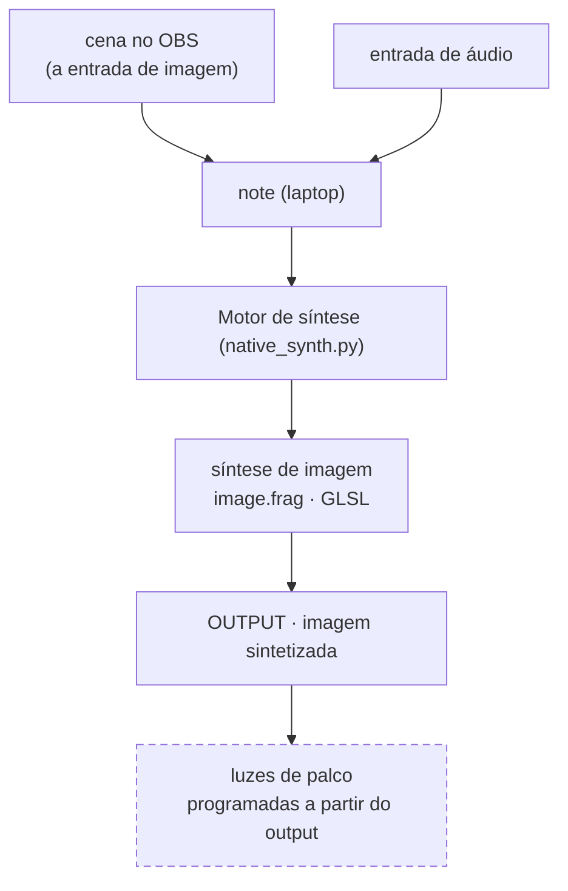

# cremas-synth-lab

Estudo pessoal de síntese de sinal de baixo nível em dois domínios que compartilham o mesmo
vocabulário (oscilador, frequência, fase, ruído, filtro, feedback): **GLSL puro** (síntese de
imagem, na GPU) e **SuperCollider** (síntese de áudio).

- **[Fluxo técnico navegável](https://paulocremas.github.io/cremas-synth-lab/)** — diagrama clicável (cada bloco pula pra explicação)
- Plano de estudo e estado do ambiente: [CLAUDE.md](CLAUDE.md)
- Índice das fontes (Book of Shaders + tutoriais Fieldsteel): [MAPA.md](MAPA.md)

Este README documenta os dois fluxos do lado prático:

1. **Técnico** — como os dados andam dentro do `native_synth.py`.
2. **Macro** — do áudio de entrada até as luzes de palco.

---

## 1. Fluxo técnico — `native_synth.py`

`native_synth.py` captura vídeo + áudio, deriva números do áudio, e alimenta um shader GLSL em
tempo real — tudo nativo. A janela OpenGL é a única saída de imagem; um **dashboard HTML**
(servido pelo próprio processo) mostra os medidores e regula tudo ao vivo.

Diagrama clicável + descrição de cada bloco (em ordem de execução) + tabela de uniforms:
**[fluxo técnico navegável](https://paulocremas.github.io/cremas-synth-lab/)**.

### Layout

```
src/          native_synth.py · dash_server.py · dash_data.py · tuning.py   (código Python)
shaders/      image.frag (base) · check.frag (fora do pipeline) · presets/<set>/*.frag
media/        <set>/*  (imagens/vídeos da galeria; gitignored)
transitions/  *.glsl  (transições de mídia, estilo gl-transitions)
(raiz)        dash.html · favicon.png · watch_synth.sh · docs/ · *.md
```

Cada subpasta de `presets/` / `media/` é um **set**, incluindo `default` (`presets/default/`,
`media/default/` são pastas de verdade — `default` é só o fallback, sempre existe). A aba Visuals
troca de set no `<select>`; os atalhos valem só no set ativo.

`native_synth.py` acha os `.frag` em `../shaders/`, a mídia em `../media/` e a `dash.html` na
raiz por caminho relativo ao próprio arquivo — rodar de qualquer cwd funciona (`./watch_synth.sh`
ou `.venv/bin/python src/native_synth.py`).

### Arquivos no caminho

| Arquivo | Papel |
|---|---|
| `src/native_synth.py` | orquestra tudo: threads de captura (reiniciáveis ao vivo), FFT de áudio, upload de uniforms, hot-reload, loop de render 30 fps, `dash_server.start()`. Na janela OpenGL, uma tecla de `tuning.SHADER_KEYS` troca o shader e uma de `tuning.MEDIA_KEYS` troca o input de imagem. Fonte de imagem pode ser webcam, tela ou um item de `tuning.MEDIA` (`mode:'media'`). Troca de mídia rápida: imagem parada vem do `_still_cache` (1 decode, depois swap de ponteiro); vídeo com `tuning.VIDEO_POOL` fica num `ffmpeg -re` sempre vivo por thread (`_pool_reader`). Na troca, um passe GPU roda a transição de `transitions/` |
| `shaders/image.frag` / `shaders/presets/<set>/*.frag` | o shader — "o synth". Recebe a imagem como textura + os uniforms de áudio, devolve a imagem sintetizada. Cabeçalho `// fx: nome1, nome2, …` declara os potenciômetros de efeito (`u_fx_<nome>`, 0..1). Hot-reload por mtime; `tuning.SHADER` (caminho relativo a `shaders/` — `image.frag` ou `presets/<set>/x.frag`) escolhe qual arquivo roda |
| `transitions/*.glsl` | transições de mídia (estilo gl-transitions): uma `vec4 transition(vec2 uv)` com `getFromColor`/`getToColor`/`progress`, cabeçalho `// ms: N` = duração. Na troca de mídia, um passe FBO mistura a imagem que sai com a que entra e alimenta o shader normal. `tuning.TRANSITION_DEFAULT` + o campo `transition` de cada item de `MEDIA` escolhem qual roda. Hot-reload por mtime |
| `media/` | `<set>/*` — imagens/vídeos da galeria de mídia (aba Visuals). Gitignored. `tuning.MEDIA[i].file` é o caminho relativo a `media/`, sempre `<set>/x.png` (inclusive `default/x.png`) |
| `src/tuning.py` | constantes de calibração: ranges de Hz das 8 faixas + `HZ_OVERLAP` + `BANDS_ENABLED`, `CHANNELS` (canais por instrumento, lista livre), `SHADER` + `SHADER_SET` + `SHADER_KEYS` (`{set: {shader: tecla}}`), `MEDIA` (com `fit` + `transition` por item) + `MEDIA_SET` + `MEDIA_KEYS` + `VIDEO_POOL`, `TRANSITION_DEFAULT`, `FX` (nível 0..1 por efeito), escalas por banda, kick, suavização. Hot-reload por mtime. Escrito ao vivo pelo dashboard (que também patcha o módulo na hora, pra troca no próximo frame) |
| `src/dash_server.py` | servidor HTTP + SSE (stdlib, sem dep). Endpoints: `/events` (stream do `state`), `/knobs` `/knob`, `/inputs` `/input` (troca de fonte áudio/vídeo), `/bands` `/tweaks` (ranges + dinâmica por faixa), `/channels`, `/shaders` `/shader` `/new-shader` `/rename-shader` `/delete-shader` `/shader-key` `/shader-set[-new\|-del]` (galeria + sets de shader), `/media` `/media-add` `/media-del` `/media-key` `/media-set[-new\|-del]` (galeria + sets de mídia; `/media-add` recebe os bytes do arquivo), `/transitions` `/transition-default` `/new-transition` `/rename-transition` `/delete-transition` (galeria de transições), `/fx`, `/output`, `/out-analysis`, `/favicon.png`. `_migrate_default_to_folder` roda no start (idempotente). Hot-reload por mtime |
| `src/dash_data.py` | funções puras que montam os dicts de números do dashboard (`audio_dash_data`; `band_magnitudes`; cores das faixas) + `parse_fx_manifest` (nomes do `// fx:` do shader). Hot-reload por mtime |
| `dash.html` | o dashboard (JS puro, sem CDN), uma aba só ("PRISMA!") com tabs "Source Audio" / "Source Image" / "Visuals" / "Output Image" / "Output Lights" no header (as duas últimas ainda placeholder). `?panel=audio` / `?panel=image` força uma seção fixa — usado pelo shift+click numa tab, que abre ela em janela própria, sincronizadas ao vivo. Sliders de knob gravam no `tuning.py`; barras de range das faixas (clica pra arrastar dali, arrasto empurra a vizinha nos dois sentidos, liga/desliga sem apagar); seção Canais (add/remove, source + "saída" por canal); aba Visuals (galeria de mídia + galeria de transições + galeria de shaders + potenciômetros de efeito; item com engrenagem: renomear / excluir / tecla; mídia tem checkbox preencher/encaixar e `<select>` de transição por item); barra "saída" no topo (monitor/dimensão/tela cheia da janela, ao vivo). Live-reload por `html_mtime` |
| `favicon.png` | ícone do dashboard (mesmo de paulocremas.github.io) |
| `watch_synth.sh` | wrapper de dev: reinicia o `src/native_synth.py` quando o próprio `.py` muda (poll de mtime a cada 1 s). Os módulos `dash_*` fazem hot-reload sozinhos, sem restart |
| `packaging/` | instalador: `deb.sh` gera `dist/prisma_<versao>_amd64.deb` (`sudo apt install ./dist/prisma_*.deb` → `/opt/prisma`, comando `prisma`, atalho "PRISMA!" no menu, e puxa `ffmpeg`/`parec`/`xrandr`… pelo apt). `build.sh` = só o binário PyInstaller (`dist/prisma/`; congela Python + numpy + pygame + PyOpenGL, fontes soltos ao lado). `launcher.py` roda o app de `~/.local/share/prisma/` (ou `$PRISMA_HOME`): código é atualizado a cada abertura, `tuning.py`/shaders/transições/mídia do usuário nunca são sobrescritos. `install.sh` = atalho local sem `.deb`, apontando pro `dist/` |
| `webcam.html` | mesma ideia no navegador (WebGL); lê o mesmo `shaders/image.frag`, conjunto reduzido de uniforms (`u_resolution`, `u_time`, `u_texture_0`, `u_amp`) |
| `shaders/check.frag` | smoke-test isolado (oscilador da Fase 1). Fora do pipeline — não aparece na galeria |

Binários externos (não versionados): `ffmpeg` (webcam/tela), `import`/ImageMagick (uma janela),
`parec`/`pactl` (áudio PulseAudio), `xrandr`/`wmctrl`/`xwininfo`/`v4l2-ctl` (geometria e fontes).
O dashboard abre no navegador padrão via `webbrowser` (stdlib) — sem `gnome-terminal`.

---

## 2. Fluxo macro — do áudio às luzes de palco

Por enquanto **só se sintetiza imagem**. O áudio nunca é sintetizado — ele **controla** a síntese
de imagem (é o que `u_bass`, `u_kick`, etc. fazem). A imagem sintetizada é a única saída.



**Estado atual:**

- **OBS** monta a cena que entra no Motor como **imagem** (via câmera virtual); em paralelo entra a **entrada de áudio**
- **Motor de síntese** (`native_synth.py`) roda o `image.frag`, que sintetiza a imagem reagindo ao áudio → **OUTPUT**
- **OUTPUT** = janela OpenGL. Monitor / dimensão / tela cheia mudam ao vivo pela barra "saída"
  no topo do dashboard (sem reiniciar o processo — `--fullscreen`/`--monitor <nome>` continuam
  valendo como valor inicial, na linha de comando); a tab "Source Image" mostra resolução do
  render, tamanho/posição da janela, fps e a lista de monitores disponíveis

**A fazer:**

- **Luzes de palco** — toda a programação de luz sai da análise do **output** (a imagem já
  sintetizada, não a original — assim as luzes reagem ao que está na tela). Hardware/protocolo
  ainda não definido (DMX / Art-Net / PWM…).
