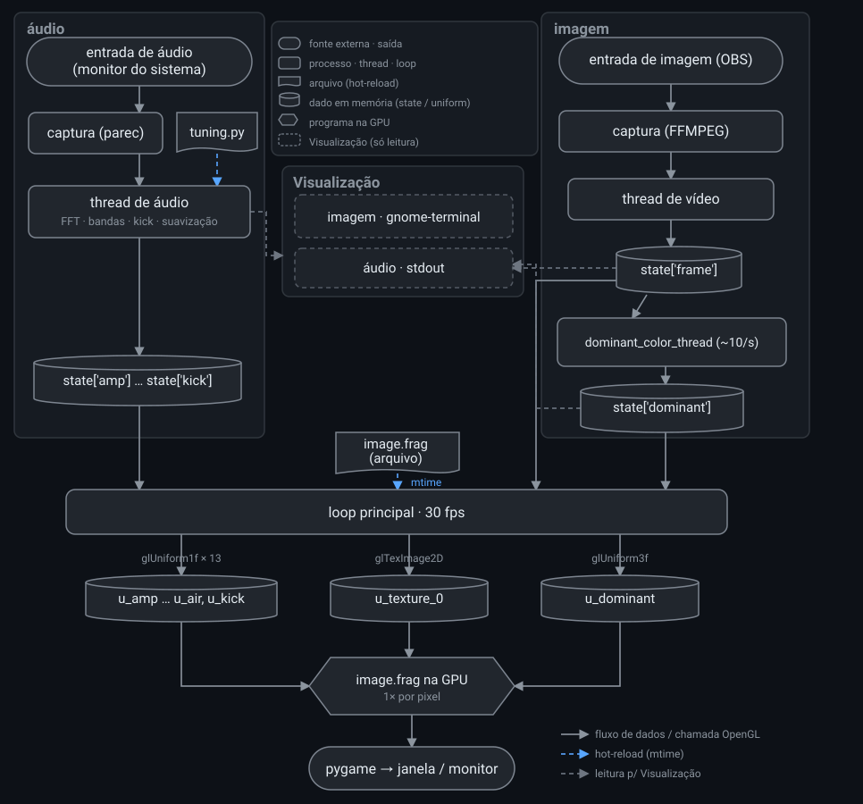
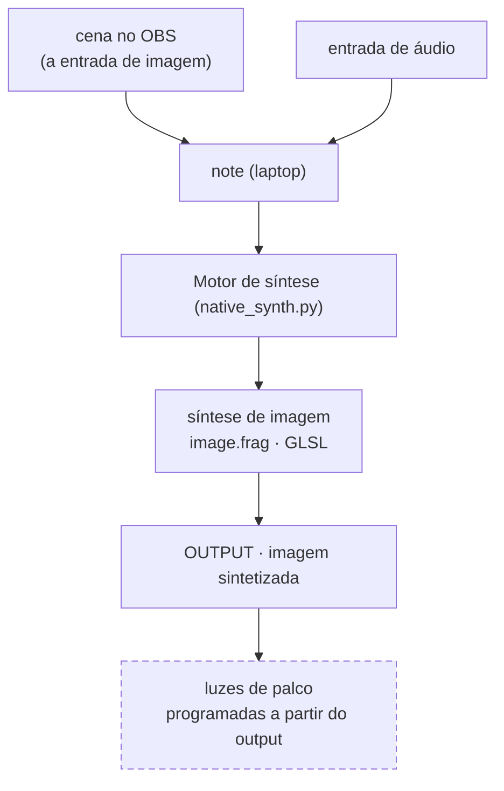

# cremas-synth-lab

Estudo pessoal de síntese de sinal de baixo nível em dois domínios que compartilham o mesmo
vocabulário (oscilador, frequência, fase, ruído, filtro, feedback): **GLSL puro** (síntese de
imagem, na GPU) e **SuperCollider** (síntese de áudio).

- **[Fluxo técnico navegável](https://paulocremas.github.io/cremas-synth-lab/)** — diagrama clicável (cada bloco pula pra explicação)
- Plano de estudo e estado do ambiente: [CLAUDE.md](CLAUDE.md)
- Índice das fontes (Book of Shaders + tutoriais Fieldsteel): [MAPA.md](MAPA.md)

Este README documenta os dois fluxos do lado prático:

1. **Técnico** — como os dados andam dentro do `native_synth.py`.
2. **Macro** — do áudio de entrada até as luzes de palco.

---

## 1. Fluxo técnico — `native_synth.py`

`native_synth.py` captura vídeo + áudio, deriva números do áudio, e alimenta um shader GLSL em
tempo real — tudo nativo, sem navegador.

### Arquivos no caminho

| Arquivo | Papel |
|---|---|
| `native_synth.py` | orquestra tudo: threads de captura, FFT de áudio, upload de uniforms, hot-reload, loop de render 30 fps |
| `image.frag` | o shader — "o synth". Recebe a imagem como textura + os uniforms de áudio, devolve a imagem sintetizada. Hot-reload por mtime |
| `tuning.py` | constantes de calibração (cortes de Hz, escalas por banda, parâmetros do kick, suavização). Hot-reload por mtime, sem reiniciar |
| `watch_synth.sh` | wrapper de dev: reinicia o `native_synth.py` quando o próprio `.py` muda (poll de mtime a cada 1 s) |
| `webcam.html` | mesma ideia no navegador (WebGL); lê o mesmo `image.frag`, conjunto reduzido de uniforms (`u_resolution`, `u_time`, `u_texture_0`, `u_amp`) |
| `check.frag` | smoke-test isolado (oscilador da Fase 1). Fora do pipeline |

Binários externos (não versionados): `ffmpeg` (webcam/tela), `import`/ImageMagick (uma janela),
`parec`/`pactl` (áudio PulseAudio), `xrandr`/`wmctrl`/`xwininfo`/`v4l2-ctl` (geometria e fontes),
`gnome-terminal` (janela da Visualização de imagem).

### O caminho

Não há fila nem socket no meio. Existe **um dicionário em memória, `state`** — as threads
escrevem, o loop de render lê 30×/s. Sempre vale o último valor; se algo atrasa, o frame velho é
descartado (nunca acumula fila).

**Imagem** — origem física → `ffmpeg` (webcam/tela) ou `import` (uma janela, segue mesmo coberta)
cospe pixels crus RGB24 → `video_thread` guarda o último em `state['frame']` → o loop sobe pra GPU
como `u_texture_0` → `texture2D()` no shader lê a cor de um ponto.

**Som** — monitor da saída padrão do sistema → `parec` cospe PCM 44,1 kHz mono → `audio_thread` lê
em chunks de 1024 amostras (~23 ms): FFT → energia em `bass`/`mid`/`treble` + 8 faixas finas,
`amp` (RMS), detector de kick, suavização attack/release → `state[...]` → o loop copia pra uniforms
0..1.

**Cor dominante** — `dominant_color_thread` lê `state['frame']`, ~10×/s quantiza as cores e conta
a mais frequente → `state['dominant']` → `u_dominant`. Thread à parte porque o cálculo é pesado
demais pra rodar a 30 fps.

**Saída** — o loop, 30×/s: sobe a textura, seta todos os uniforms, manda a GPU desenhar um
triângulo único que cobre a tela → a GPU roda `image.frag` 1× por pixel, em paralelo → `pygame`
mostra o resultado (janela, fullscreen, ou fixo num monitor com `--monitor`).

### Variáveis do shader — em uso

Todas alimentadas todo frame pelo `native_synth.py`:

| uniform | tipo | faixa | origem | significado |
|---|---|---|---|---|
| `u_resolution` | vec2 | px | loop | tamanho da janela |
| `u_time` | float | s | loop | segundos desde o início |
| `u_texture_0` | sampler2D | — | `video_thread` | frame de vídeo de entrada |
| `u_amp` | float | 0..1 | `audio_thread` | volume RMS geral |
| `u_bass` | float | 0..1 | `audio_thread` | energia < 150 Hz (`tuning.BASS_MID_HZ`) |
| `u_mid` | float | 0..1 | `audio_thread` | energia 150 Hz – 4 kHz |
| `u_treble` | float | 0..1 | `audio_thread` | energia > 4 kHz (`tuning.MID_TREBLE_HZ`) |
| `u_kick` | float | 0..1 | `audio_thread` | pulso de batida: sobe pra 1 e decai sozinho (não é nível) |
| `u_dominant` | vec3 | 0..1 | `dominant_color_thread` | cor mais frequente do frame |
| `u_subbass` | float | 0..1 | `audio_thread` | 0 – 250 Hz |
| `u_lowmid` | float | 0..1 | `audio_thread` | 250 – 500 Hz |
| `u_midrange` | float | 0..1 | `audio_thread` | 500 Hz – 2 kHz |
| `u_highmid` | float | 0..1 | `audio_thread` | 2 – 4 kHz |
| `u_presence` | float | 0..1 | `audio_thread` | 4 – 6 kHz |
| `u_treble_hi` | float | 0..1 | `audio_thread` | 6 – 10 kHz |
| `u_brilho` | float | 0..1 | `audio_thread` | 10 – 16 kHz |
| `u_air` | float | 0..1 | `audio_thread` | > 16 kHz |

As 8 faixas finas (`u_subbass`..`u_air`) vêm em nível **relativo ao pico entre elas** (auto-calibra
com qualquer volume/fonte; por isso alguma está quase sempre em 1.0).

Embutidas do GLSL, já usadas no `image.frag`: `gl_FragCoord` (posição do pixel), `gl_FragColor`
(cor de saída).

### Variáveis disponíveis — NÃO conectadas

Tudo abaixo já é **calculado** hoje (ou é convenção trivial de ligar), mas só aparece nos
Visualizações de texto. Vira uniform novo com ~2 linhas: declarar em `image.frag` + um `glUniform*`
no loop de `native_synth.py`.

**Áudio — já calculado no `audio_thread`:**

| dado | o que é |
|---|---|
| magnitude bruta por banda | as 8 faixas finas antes de normalizar (coluna BRUTO da Visualização) |
| `bass_raw` / `mid_raw` / `treble_raw` | trio clássico sem escala nem clamp |
| `amp_raw` | RMS puro, sem o `×4` nem clamp |
| smoothing usado por banda | o attack/release que valeu naquele chunk (coluna SMOOTH) |
| `kick_baseline` | média lenta do grave (o "chão" que o kick compara) |
| `kick_decay_dynamic` | taxa de decaimento do kick, adaptada ao ritmo da música |
| espectrograma absoluto | 24 faixas log, dB real (não normalizado) |
| espectrograma relativo | 24 faixas log, % do pico do frame |
| `smooth_spectrum` | a FFT inteira suavizada (todos os bins) |

**Imagem — já calculado quando a Visualização de imagem está aberta.** Com medida global **e** mapa
3×3 ("onde na tela"):

| métrica | o que é |
|---|---|
| brilho | canal V médio |
| saturação | canal S médio |
| temperatura de cor | (R − B) médio, −1 frio … +1 quente |
| contraste | desvio-padrão do brilho |
| nitidez | variância do Laplaciano (medida de foco) |
| entropia | espalhamento do histograma de brilho |
| bordas | densidade de gradiente |
| movimento | diferença média entre o frame atual e o anterior |

Só global (sem grid):

| métrica | o que é |
|---|---|
| cor média | média RGB de verdade (≠ dominante, que é a moda) |
| simetria | metade esquerda × direita espelhada |
| clipping | % de pixels estourados / escurecidos |
| correlação R/G/B | baixa = bem colorido, alta = quase monocromático |
| centro de massa do brilho | onde na tela está o "peso" visual (x, y) |
| coloridez | métrica de Hasler–Süsstrunk (mais rígida que saturação média) |
| paleta | nº de cores únicas quantizadas |
| mudança de cor | distância RGB entre a cor média deste frame e do anterior |
| tom quente / pele | fração dos pixels coloridos numa faixa de matiz quente |

Distribuições (histograma inteiro, não um número):

| distribuição | o que é |
|---|---|
| histograma de matiz | 12 faixas, cada uma uma cor, pesado por saturação |
| histograma de brilho | 16 faixas, claro → escuro |
| espectro espacial de cor | FFT 2D por canal R/G/B, reduzida a 20 anéis radiais (textura fina × área lisa) |
| orientação de borda | 9 faixas de ângulo (pra que lado as bordas apontam) |

**Convenção GLSL não ligada:**

| uniform | o que seria |
|---|---|
| `u_mouse` | posição do mouse (padrão Book of Shaders / glsl-canvas). `native_synth.py` não trata mouse |
| `u_texture_1`, `u_texture_2`… | canais de textura extras (só o `_0` é usado) |
| buffer de feedback | o frame de saída **anterior** como textura de entrada — o "pingpong" da Fase 3 (feedback), ainda não implementado |
| `u_tex0_resolution` | tamanho da textura de entrada (hoje o shader assume que casa com a tela) |

---

## 2. Fluxo macro — do áudio às luzes de palco

Por enquanto **só se sintetiza imagem**. O áudio nunca é sintetizado — ele **controla** a síntese
de imagem (é o que `u_bass`, `u_kick`, etc. fazem). A imagem sintetizada é a única saída.

**Estado atual:**

- **OBS** monta a cena que entra no Motor como **imagem** (via câmera virtual); em paralelo entra a **entrada de áudio**
- **Motor de síntese** (`native_synth.py`) roda o `image.frag`, que sintetiza a imagem reagindo ao áudio → **OUTPUT**

**A fazer:**

- **Luzes de palco** — toda a programação de luz sai da análise do **output** (a imagem já
  sintetizada, não a original — assim as luzes reagem ao que está na tela). Hardware/protocolo
  ainda não definido (DMX / Art-Net / PWM…).
