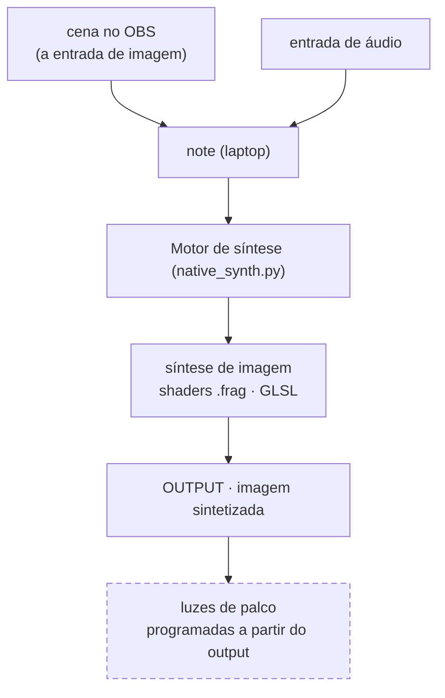

# cremas-synth-lab

Estudo pessoal de síntese de sinal de baixo nível em dois domínios que compartilham o mesmo
vocabulário (oscilador, frequência, fase, ruído, filtro, feedback): **GLSL puro** (síntese de
imagem, na GPU) e **SuperCollider** (síntese de áudio).

- **[Fluxo técnico navegável](https://paulocremas.github.io/cremas-synth-lab/)** — diagrama clicável (cada bloco pula pra explicação)
- Plano de estudo e estado do ambiente: [CLAUDE.md](CLAUDE.md)
- Índice das fontes (Book of Shaders + tutoriais Fieldsteel): [MAPA.md](MAPA.md)

Este README documenta os dois fluxos do lado prático:

1. **Técnico** — como os dados andam dentro do `native_synth.py`.
2. **Macro** — do áudio de entrada até as luzes de palco.

---

## 1. Fluxo técnico — `native_synth.py`

`native_synth.py` captura imagem (câmeras, telas, mídias) + áudio, deriva números do áudio e
passa cada fonte de imagem pela sua pilha de shaders GLSL em tempo real — tudo nativo. A janela OpenGL é a única saída de imagem; um **dashboard HTML**
(servido pelo próprio processo) mostra os medidores e regula tudo ao vivo.

Diagrama clicável + descrição de cada bloco (em ordem de execução) + tabela de uniforms:
**[fluxo técnico navegável](https://paulocremas.github.io/cremas-synth-lab/)**.

### Layout

```
src/          native_synth.py · dash_server.py · dash_data.py · tuning.py   (código Python)
shaders/      image.frag (base) · calibrar.frag (último passe da saída) · check.frag (fora do pipeline) · presets/default/*.frag
media/        default/*  (imagens/vídeos da biblioteca; gitignored)
transitions/  *.glsl  (transições entre sets, estilo gl-transitions)
(raiz)        dash.html (v1) · dash2.html (v2, ao vivo) · favicon.png · watch_synth.sh · docs/ · *.md
```

**Sets** não são pastas: são cenas guardadas no `tuning.py` (`SCENES`). Cada set diz quais
fontes/mídias entram na saída, a pilha de shaders de cada uma (opacidade, modo de mistura, forças
dos efeitos), o que o set oferece, a tecla e a transição de entrada. Os arquivos (mídia, `.frag`,
`.glsl`) formam uma biblioteca única, compartilhada pelos sets.

`native_synth.py` acha os `.frag` em `../shaders/`, a mídia em `../media/` e a `dash.html` na
raiz por caminho relativo ao próprio arquivo — rodar de qualquer cwd funciona (`./watch_synth.sh`
ou `.venv/bin/python src/native_synth.py`). O app empacotado (`prisma`) roda uma **cópia** em
`~/.local/share/prisma/` — ver `packaging/` abaixo.

### Arquivos no caminho

| Arquivo | Papel |
|---|---|
| `src/native_synth.py` | orquestra tudo: threads de captura (reiniciáveis ao vivo), FFT de áudio, uniforms, hot-reload, loop de render (`tuning.OUTPUT_FPS`, padrão 60), `dash_server.start()`. **A saída é só o que está marcado** (`OVERLAYS`): cada fonte marcada (câmera, tela ou mídia) sobe como textura, passa pela SUA pilha de shaders (`BINDINGS`: opacidade + modo de mistura + forças `u_fx_*` por shader) num FBO, e entra na saída com a opacidade dela. Tecla de set (campo `key` de `SCENES`) troca de set na janela OpenGL; a troca roda a transição de `transitions/` sobre a imagem final. Troca rápida de mídia: imagem parada vem do `_still_cache`, vídeo com `tuning.VIDEO_POOL` fica num `ffmpeg -re` sempre vivo (`_pool_reader`) |
| `shaders/image.frag` / `shaders/presets/default/*.frag` | os shaders — "o synth". Recebem a imagem de UMA fonte como textura (`u_texture_0`) + os uniforms de áudio, devolvem a imagem sintetizada. Cabeçalho `// fx: nome1, nome2, …` declara os potenciômetros de efeito (`u_fx_<nome>`, 0..1). Um arquivo serve a quantas fontes/sets quiser: o código é compartilhado, a configuração é por fonte. Hot-reload por mtime |
| `transitions/*.glsl` | transições **entre sets** (estilo gl-transitions): uma `vec4 transition(vec2 uv)` com `getFromColor`/`getToColor`/`progress`, cabeçalho `// ms: N` = duração. Na troca de set, o último passe mistura a imagem final do set que sai com a do que entra. Cada set escolhe a sua; `(padrão)` = `tuning.TRANSITION_DEFAULT`. Hot-reload por mtime |
| `media/` | `default/*` — imagens/vídeos da biblioteca. Gitignored. `tuning.MEDIA[i]` = `{name, file, kind, fit, bounce?}` (`fit`: `fill` = estica, `fit` = encaixa com margens; `bounce` = rebate) |
| `src/tuning.py` | constantes de calibração (ranges de Hz das 8 faixas + `HZ_OVERLAP` + `BANDS_ENABLED`, escalas, kick, suavização, `CHANNELS`) e o estado da aba Visuals: `SCENES` + `SCENE` (sets e o ativo), `OVERLAYS` (fontes marcadas), `BINDINGS` (pilha de shaders + forças por fonte), `MEDIA`, `SOURCE_FIT`, `VIDEO_POOL`, `TRANSITION_DEFAULT`. Hot-reload por mtime. Escrito ao vivo pelo dashboard (que também patcha o módulo na hora, pra valer no próximo frame). `SHADER`/`SHADER_LAYERS`/`FX`/`*_SET`/`*_KEYS` sobraram de versões antigas, sem uso |
| `src/dash_server.py` | servidor HTTP + SSE (stdlib, sem dep). Endpoints: `/events` (stream do `state`), `/knobs` `/knob`, `/inputs` `/input` (fonte de áudio), `/bands` `/tweaks`, `/channels`; aba Visuals · Sets: `/scenes` `/scene` `/scene-new` `/scene-rename` `/scene-del` `/scene-key` `/scene-transition`, `/overlays`, `/bindings`, `/select`, `/pool`, `/source-fit`; Biblioteca: `/shaders` `/new-shader` `/rename-shader` `/delete-shader`, `/media` `/media-add` `/media-del`, `/transitions` `/transition-default` `/new-transition` `/rename-transition` `/delete-transition`; `/output`, `/output-fps`, `/output-grade`, `/out-analysis`, `/screens` (telas do palco = canvas), `/frame` (prévias do dash v2: saída, fonte crua, fonte com efeitos), `/v2`, `/favicon.png`. Migrações one-shot no start (`_migrate_default_to_folder`, `_migrate_to_scenes`). Hot-reload por mtime. Self-check: `.venv/bin/python src/dash_server.py` |
| `src/dash_data.py` | funções puras que montam os dicts de números do dashboard (`audio_dash_data`; `band_magnitudes`; cores das faixas) + `parse_fx_manifest` (nomes do `// fx:` de um shader). Hot-reload por mtime |
| `dash.html` | o dashboard (JS puro, sem CDN), uma aba só ("PRISMA!") com tabs "Source Audio" / "Source Image" / "Visuals" / "Output Image" / "Output Lights" (as duas últimas ainda placeholder); shift+click numa tab abre ela em janela própria (`?panel=…`), sincronizadas ao vivo. Visuals tem duas sub-abas: **Sets** (lista de sets com tecla + transição; e o set ativo: Imagem — Fontes e Mídias com camada/opacidade/preencher/rebate, clique = selecionar —, Efeitos da fonte selecionada, Força dos efeitos, `×` / `+ adicionar ao set…`) e **Biblioteca** (mídia, `.frag`, transições). Barra "saída" no topo (monitor/dimensão/tela cheia, ao vivo). Live-reload por `html_mtime` |
| `dash2.html` | dash v2 pra usar **ao vivo** (`/v2`): abas Palco (scenes + mesa ou vista **Canvas** — cada fonte no ar é um objeto arrastável com prévia pós-efeitos, bandeja das fora do ar — + monitor da saída + inspetor), Áudio (espectro com as 8 faixas arrastáveis e grudadas + colunas por faixa), Imagem (entrada crua × saída, mapas 3×3 sobre a prévia), Saída (janela, fps, **telas do palco** em metros + px, calibração), Biblioteca. Modo Palco × Editar, knobs de arrasto relativo, MIDI learn com soft takeover, MASTER/BLACKOUT, saúde (chips no topo com detalhe no clique + moldura colorida), 60 fps. Decisões de design no comentário do topo |
| `favicon.png` | ícone do dashboard (mesmo de paulocremas.github.io) |
| `watch_synth.sh` | wrapper de dev: reinicia o `src/native_synth.py` quando o próprio `.py` muda (poll de mtime a cada 1 s). Os módulos `dash_*` fazem hot-reload sozinhos, sem restart |
| `packaging/` | instalador: `deb.sh` gera `dist/prisma_<versao>_amd64.deb` (`sudo apt install ./dist/prisma_*.deb` → `/opt/prisma`, comando `prisma`, atalho "PRISMA!" no menu, e puxa `ffmpeg`/`parec`/`xrandr`… pelo apt). `build.sh` = só o binário PyInstaller (`dist/prisma/`; congela Python + numpy + pygame + PyOpenGL, fontes soltos ao lado). `launcher.py` roda o app de `~/.local/share/prisma/` (ou `$PRISMA_HOME`): a cada abertura copia o **código** (`src/*.py` menos `tuning.py`, `dash.html`, `dash2.html`) por cima; `tuning.py`/shaders/transições/mídia do usuário nunca são sobrescritos. Mudou o código no repo? copie pra `dist/prisma/` (ou rode `build.sh`) e reabra. `install.sh` = atalho local sem `.deb`, apontando pro `dist/` |
| `webcam.html` | mesma ideia no navegador (WebGL); lê o mesmo `shaders/image.frag`, conjunto reduzido de uniforms (`u_resolution`, `u_time`, `u_texture_0`, `u_amp`) |
| `shaders/check.frag` | smoke-test isolado (oscilador da Fase 1). Fora do pipeline — não aparece na galeria |

Binários externos (não versionados): `ffmpeg` (webcam/tela), `import`/ImageMagick (uma janela),
`parec`/`pactl` (áudio PulseAudio), `xrandr`/`wmctrl`/`xwininfo`/`v4l2-ctl` (geometria e fontes).
O dashboard abre em janela própria (Brave/Chrome `--app --kiosk`, perfil separado) que fecha junto
com o app; sem navegador Chromium, cai no navegador padrão via `webbrowser` (aí a aba fica aberta).

---

## 2. Fluxo macro — do áudio às luzes de palco

Por enquanto **só se sintetiza imagem**. O áudio nunca é sintetizado — ele **controla** a síntese
de imagem (é o que `u_bass`, `u_kick`, etc. fazem). A imagem sintetizada é a única saída.



**Estado atual:**

- **OBS** monta a cena que entra no Motor como **imagem** (via câmera virtual); em paralelo entra a **entrada de áudio**
- **Motor de síntese** (`native_synth.py`) passa cada fonte marcada pelos seus shaders, que sintetizam a imagem reagindo ao áudio → **OUTPUT**
- **OUTPUT** = janela OpenGL. Monitor / dimensão / tela cheia mudam ao vivo pela barra "saída"
  no topo do dashboard (sem reiniciar o processo — `--fullscreen`/`--monitor <nome>` continuam
  valendo como valor inicial, na linha de comando); a tab "Source Image" mostra resolução do
  render, tamanho/posição da janela, fps e a lista de monitores disponíveis

**A fazer:**

- **Luzes de palco** — toda a programação de luz sai da análise do **output** (a imagem já
  sintetizada, não a original — assim as luzes reagem ao que está na tela). Hardware/protocolo
  ainda não definido (DMX / Art-Net / PWM…).
