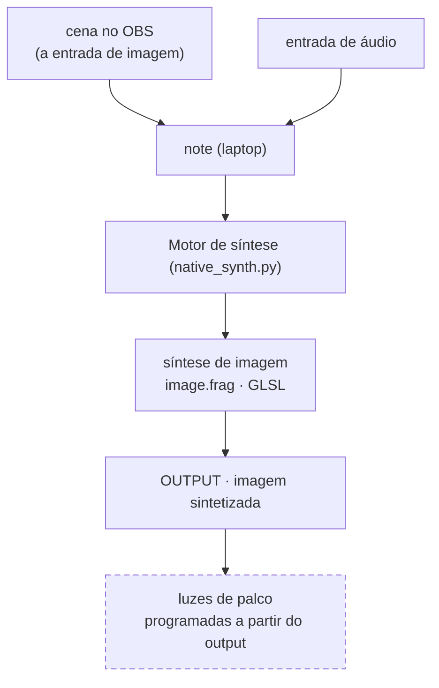

# cremas-synth-lab

Estudo pessoal de síntese de sinal de baixo nível em dois domínios que compartilham o mesmo
vocabulário (oscilador, frequência, fase, ruído, filtro, feedback): **GLSL puro** (síntese de
imagem, na GPU) e **SuperCollider** (síntese de áudio).

- **[Fluxo técnico navegável](https://paulocremas.github.io/cremas-synth-lab/)** — diagrama clicável (cada bloco pula pra explicação)
- Plano de estudo e estado do ambiente: [CLAUDE.md](CLAUDE.md)
- Índice das fontes (Book of Shaders + tutoriais Fieldsteel): [MAPA.md](MAPA.md)

Este README documenta os dois fluxos do lado prático:

1. **Técnico** — como os dados andam dentro do `native_synth.py`.
2. **Macro** — do áudio de entrada até as luzes de palco.

---

## 1. Fluxo técnico — `native_synth.py`

`native_synth.py` captura vídeo + áudio, deriva números do áudio, e alimenta um shader GLSL em
tempo real — tudo nativo. A janela OpenGL é a única saída de imagem; um **dashboard HTML**
(servido pelo próprio processo) mostra os medidores e regula tudo ao vivo.

Diagrama clicável + descrição de cada bloco (em ordem de execução) + tabela de uniforms:
**[fluxo técnico navegável](https://paulocremas.github.io/cremas-synth-lab/)**.

### Arquivos no caminho

| Arquivo | Papel |
|---|---|
| `native_synth.py` | orquestra tudo: threads de captura (reiniciáveis ao vivo), FFT de áudio, upload de uniforms, hot-reload, loop de render 30 fps, `dash_server.start()` |
| `image.frag` | o shader — "o synth". Recebe a imagem como textura + os uniforms de áudio, devolve a imagem sintetizada. Hot-reload por mtime |
| `tuning.py` | constantes de calibração: ranges de Hz das 8 faixas + `HZ_OVERLAP` + `BANDS_ENABLED`, `CHANNELS` (canais por instrumento, lista livre), escalas por banda, kick, suavização. Hot-reload por mtime. Escrito ao vivo pelo dashboard |
| `dash_server.py` | servidor HTTP + SSE (stdlib, sem dep). Endpoints: `/events` (stream do `state`), `/knobs` `/knob`, `/inputs` `/input` (troca de fonte áudio/vídeo), `/bands` (ranges + overlap + ativar/desativar), `/channels` (add/remove/editar canal), `/output` (monitor/dimensão/tela cheia da janela de saída, sem reiniciar), `/favicon.png`. Hot-reload por mtime |
| `dash_data.py` | funções puras que montam os dicts de números do dashboard (`audio_dash_data`; `band_magnitudes`; cores das faixas). Hot-reload por mtime |
| `dash.html` | o dashboard (JS puro, sem CDN). `?panel=audio` / `?panel=image` = duas abas ("Audio Input" / "Image Input"), sincronizadas ao vivo. Sliders de knob gravam no `tuning.py`; barras de range das faixas (clica pra arrastar dali, arrasto empurra a vizinha nos dois sentidos, liga/desliga sem apagar); seção Canais (add/remove, source + "saída" por canal); barra "saída" no topo (monitor/dimensão/tela cheia da janela, ao vivo). Live-reload por `html_mtime` |
| `favicon.png` | ícone do dashboard (mesmo de paulocremas.github.io) |
| `watch_synth.sh` | wrapper de dev: reinicia o `native_synth.py` quando o próprio `.py` muda (poll de mtime a cada 1 s). Os módulos `dash_*` fazem hot-reload sozinhos, sem restart |
| `webcam.html` | mesma ideia no navegador (WebGL); lê o mesmo `image.frag`, conjunto reduzido de uniforms (`u_resolution`, `u_time`, `u_texture_0`, `u_amp`) |
| `check.frag` | smoke-test isolado (oscilador da Fase 1). Fora do pipeline |

Binários externos (não versionados): `ffmpeg` (webcam/tela), `import`/ImageMagick (uma janela),
`parec`/`pactl` (áudio PulseAudio), `xrandr`/`wmctrl`/`xwininfo`/`v4l2-ctl` (geometria e fontes).
O dashboard abre no navegador padrão via `webbrowser` (stdlib) — sem `gnome-terminal`.

---

## 2. Fluxo macro — do áudio às luzes de palco

Por enquanto **só se sintetiza imagem**. O áudio nunca é sintetizado — ele **controla** a síntese
de imagem (é o que `u_bass`, `u_kick`, etc. fazem). A imagem sintetizada é a única saída.

**Estado atual:**

- **OBS** monta a cena que entra no Motor como **imagem** (via câmera virtual); em paralelo entra a **entrada de áudio**
- **Motor de síntese** (`native_synth.py`) roda o `image.frag`, que sintetiza a imagem reagindo ao áudio → **OUTPUT**
- **OUTPUT** = janela OpenGL. Monitor / dimensão / tela cheia mudam ao vivo pela barra "saída"
  no topo do dashboard (sem reiniciar o processo — `--fullscreen`/`--monitor <nome>` continuam
  valendo como valor inicial, na linha de comando); a aba "Image Input" mostra resolução do
  render, tamanho/posição da janela, fps e a lista de monitores disponíveis

**A fazer:**

- **Luzes de palco** — toda a programação de luz sai da análise do **output** (a imagem já
  sintetizada, não a original — assim as luzes reagem ao que está na tela). Hardware/protocolo
  ainda não definido (DMX / Art-Net / PWM…).
